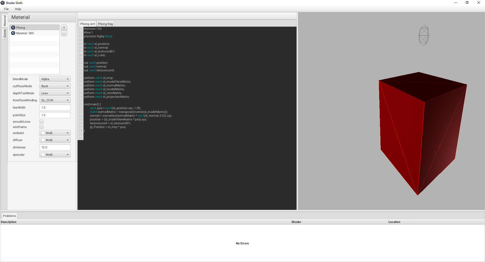

[](https://travis-ci.org/yveskaufmann/shader-sloth)

# ShaderSloth

ShaderSloth allows it to create and play with [GLSL](https://www.opengl.org/documentation/glsl/) shaders without programming 
any line of OpenGL code. It is the result of a assignment for the university. 



These features are currently provided:

* [x] scene creation 
* [x] simple shader/material editor  
* [x] shader render-view with instant feedback
* [ ] texture support (already supported in the engine) 
* [ ] multiple pass rendering (already supported in the engine)
* [ ] glsl autocomplete


Requirements
------------

- [JDK](http://www.oracle.com/technetwork/java/javase/downloads/index.html) >= 8u91
- [Apache Maven](https://maven.apache.org/) >= 3.0
- A GPU which supports at least OpenGL 3.x

Building
--------

In order to build ShaderSloth it is required that [Apache Maven > 3.0](https://maven.apache.org/) and  
a [JDK >= 8u91](http://www.oracle.com/technetwork/java/javase/downloads/index.html) is already installed 
on your computer. TPlease consults the corresponding documentation for the specific installation instructions.

## Build Steps

### 1) Check-Out Sloth-Engine

```bash
cd shader-sloth
git clone https://github.com/yveskaufmann/sloth-engine 
```

### 2) Build Sloth-Engine

```bash
cd sloth-engine
git checkout develop
mvn install
```

### 3) Build Shader-Sloth

```bash
cd shader-sloth
mvn package -DskipTests
```


